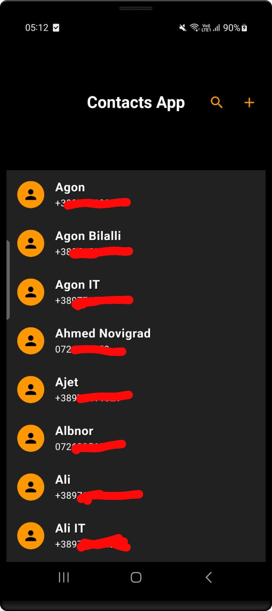
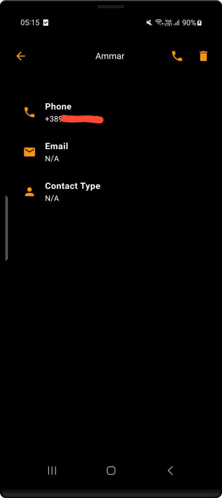
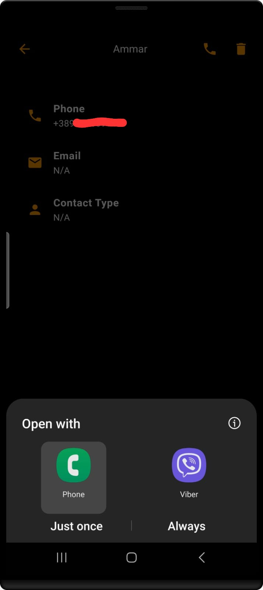
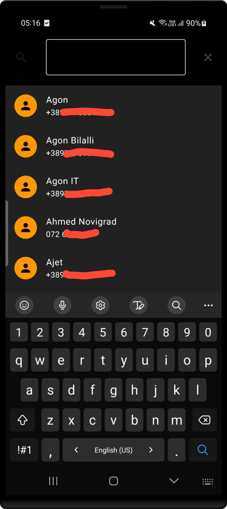
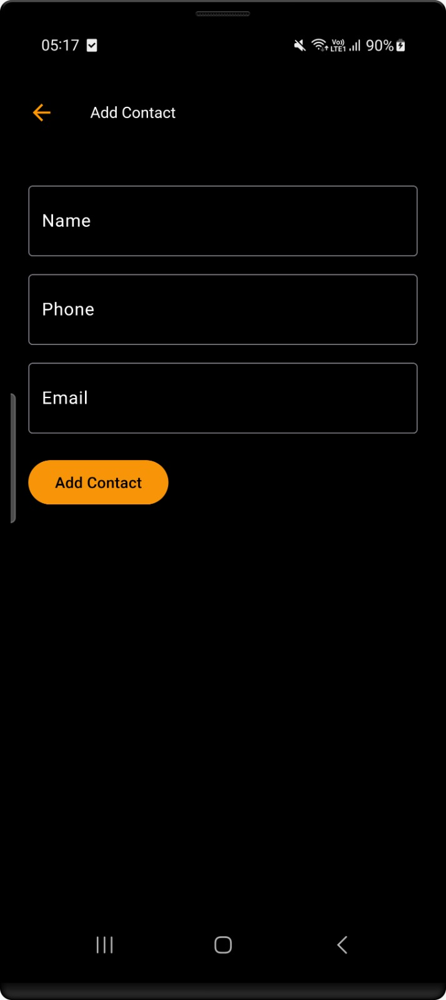
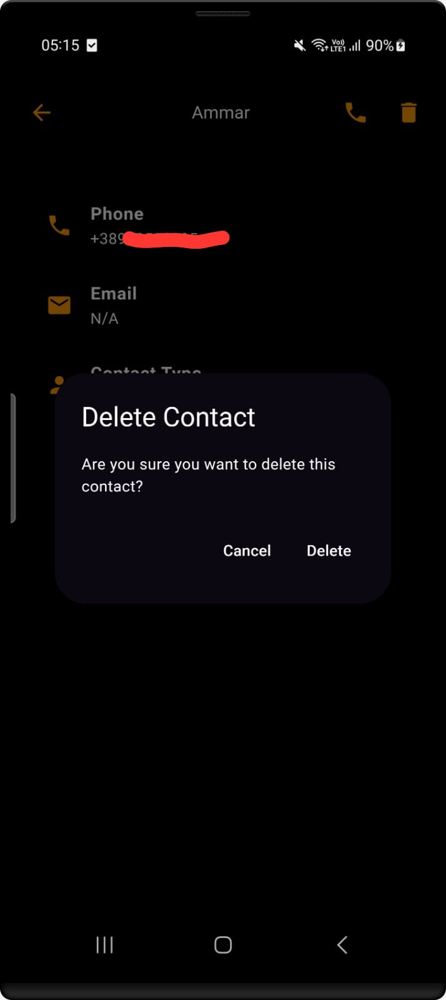

# Flutter Contacts App

A Flutter application to manage contacts on both Android and iOS devices.

## Overview
The Flutter Contacts App allows users to view, add, search, and delete contacts on their mobile devices. It provides a user-friendly interface for managing contacts efficiently.

## Features
 
- View a list of contacts with their names and phone numbers.
- Add new contacts with names, phone numbers, and email addresses.
- Search for contacts by name.
- Navigate to the phone app to call contacts.
- Delete contacts from the list.
- View detailed information about each contact, including their name, phone number, email address, and contact type.

## Screenshots

 

## Installation

**1.** Clone the repository. 
**2.** Navigate to the project directory. 
**3.** Install dependencies: 
&nbsp;&nbsp;&nbsp;&nbsp;contacts_service: ^0.6.3 
&nbsp;&nbsp;&nbsp;&nbsp;url_launcher: ^6.2.5 
&nbsp;&nbsp;&nbsp;&nbsp;flutter_contacts: ^1.1.7+1 

**4.** Run the app

## Usage
- Open the app on your device or emulator.
- Browse the list of contacts or use the search feature to find specific contacts.
- Tap on a contact to view detailed information.
- Navigate to the phone app to call a contact.
- Use the add button to create a new contact.
- Use the delete button to remove a contact.

